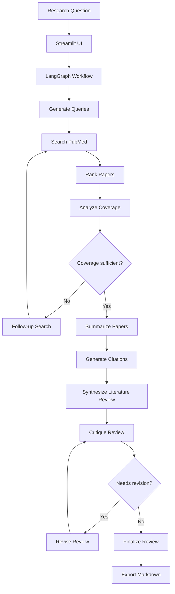

# ResearchFlow


> An agentic literature review assistant that automatically searches PubMed, retrieves and ranks relevant research papers, synthesizes evidence, critiques its own review, and exports a publication-ready literature review.

---

## Demo

Watch the demo video for Research Flow on [YouTube](https://youtu.be/vDiqEymjsjA)

---

## Quick Start

```bash
git clone https://github.com/jimmybach/ResearchFlow.git
cd ResearchFlow

python3 -m venv .venv
source .venv/bin/activate

pip install -e .

cp .env.example .env
# Add your Google API key to .env

streamlit run app/streamlit_ui.py
```
---
## Overview

ResearchFlow is an AI-powered research assistant built with LangGraph that automates the early stages of scientific literature review.

Rather than simply retrieving papers or generating summaries, ResearchFlow performs a multi-stage reasoning workflow:

1. Generates diverse PubMed search queries from a research question.
2. Retrieves relevant publications through a PubMed MCP server.
3. Removes duplicates and caches papers.
4. Ranks papers using semantic embeddings.
5. Evaluates literature coverage and optionally performs additional targeted searches.
6. Summarizes individual papers.
7. Synthesizes a thematic literature review.
8. Critiques its own review.
9. Revises the review until quality criteria are met.
10. Exports the final review with citations in Markdown.

The project demonstrates agentic workflows, structured LLM outputs, semantic search, iterative reasoning, and software engineering best practices for production AI systems.

---

# Features

- PubMed search through MCP
- Automatic query generation
- Paper deduplication and caching
- Local semantic embedding ranking
- Coverage gap analysis
- Adaptive follow-up searches
- Structured paper summarization
- Multi-theme literature review synthesis
- Self-critique and iterative revision
- Citation generation
- Markdown export
- Modular service-oriented architecture

---

# Example Output

ResearchFlow generates a structured literature review including:

- Introduction
- Major themes
- Supporting studies
- Limitations
- Research gaps
- Conclusion
- Hyperlinked references

Example:

```markdown
## Therapeutic Efficacy

Exercise consistently improves symptoms of depression and anxiety
when used alongside standard psychiatric care.

Supporting studies

- Physical activity, exercise, and mental disorders...
- The Role of Exercise in Management of Mental Health Disorders...
- Exercise as Medicine for Mental Disorders...
```

---

# Project Structure

```
src/

├── graph/
│   ├── builder.py
│   ├── state.py
│   └── nodes/
│
├── prompts/
│
├── schema/
│
├── services/
│   ├── embeddings.py
│   ├── export.py
│   ├── llm.py
│   └── mcp/
│
├── utils/
│
└── tests/
```

---

# Technology Stack

- Python
- LangGraph
- LangChain
- Google Gemini
- SentenceTransformers
- PubMed MCP
- Pydantic
- NumPy
- pytest

---

# Agent Architecture

ResearchFlow is implemented as a stateful LangGraph workflow.

Each node performs one isolated responsibility.

Examples include:

- Generate search queries
- Search PubMed
- Rank papers
- Analyze coverage
- Summarize papers
- Synthesize review
- Critique review
- Revise review
- Export review

Routing decisions are performed dynamically using graph state.

---
## Architecture Diagram


---

# Design Decisions

ResearchFlow was designed with an emphasis on modularity, reproducibility, and agentic reasoning rather than simply producing a literature review.

## Why LangGraph?

A literature review is inherently an iterative process. Researchers often need to search, evaluate coverage, refine queries, and revise drafts multiple times.

LangGraph models this process naturally through a stateful workflow with conditional routing and bounded feedback loops. This enables ResearchFlow to:

- revisit literature searches when coverage is insufficient
- critique and revise generated reviews
- maintain state across multiple reasoning steps
- separate individual reasoning tasks into reusable nodes

Rather than relying on one large prompt, the workflow is decomposed into specialized reasoning stages.

---

## Why MCP for PubMed?

Instead of directly calling the PubMed REST API, ResearchFlow uses a PubMed MCP server.

This abstraction provides:

- standardized tool interfaces
- simplified tool orchestration
- cleaner service-layer code
- flexibility to swap or extend data sources without changing the graph

The graph interacts with a `PubMedService` rather than individual API endpoints, reducing coupling between workflow logic and external services.

---

## Why Structured Outputs?

Every LLM stage returns validated Pydantic models instead of raw text.

Examples include:

- Paper
- PaperSummary
- CoverageAnalysis
- LiteratureReview
- ReviewCritique
- Citation

Structured outputs provide several benefits:

- runtime validation
- reduced parsing errors
- predictable downstream behavior
- easier testing
- cleaner prompt engineering

This makes the workflow significantly more reliable than passing unstructured text between nodes.

---

## Why Local Embeddings?

ResearchFlow uses local sentence embedding models for semantic ranking rather than cloud embedding APIs.

This design was chosen to:

- eliminate API rate limits
- reduce operating costs
- improve reproducibility
- allow offline execution
- support large-scale paper retrieval

Since embeddings are only used for semantic filtering—not final reasoning—local models provide an excellent balance between quality and performance.

---

## Why Multi-Stage Ranking?

Large literature searches can easily return 50–100+ papers.

Sending every paper directly to an LLM is expensive and unnecessary.

ResearchFlow progressively narrows the candidate set:

1. Retrieve papers from PubMed.
2. Remove duplicates.
3. Rank papers using semantic embeddings.
4. Perform coverage analysis.
5. Summarize only the highest-value papers.

This hierarchical filtering dramatically reduces token usage while maintaining review quality.

---

## Why Self-Critique?

The first draft produced by an LLM is not assumed to be the best draft.

ResearchFlow incorporates an explicit critique stage that evaluates:

- thematic coverage
- factual support
- organization
- missing topics
- unsupported claims

If necessary, the review is revised before being finalized.

This bounded feedback loop improves overall review quality while preventing infinite revision cycles.

---

## Why Service-Oriented Architecture?

Business logic is separated into dedicated services:

- PubMed service
- Embedding service
- LLM service
- Export service

This separation keeps graph nodes lightweight and focused on orchestration rather than implementation details.

As a result, components can be tested, replaced, or extended independently.

---

## Why Evidence Traceability?

Every synthesized theme maintains references to the supporting PubMed papers used during generation.

This allows users to:

- inspect supporting evidence
- verify synthesized claims
- navigate directly to source publications
- maintain transparency throughout the review process

Rather than acting as a black box, ResearchFlow exposes the evidence underlying every major conclusion.

---

## Design Philosophy

ResearchFlow is designed around a simple principle:

> Use LLMs for reasoning—not for everything.

Deterministic tasks such as retrieval, caching, parsing, ranking, validation, routing, and exporting are implemented using conventional software engineering techniques.

LLMs are reserved for tasks that genuinely require reasoning, including query generation, summarization, synthesis, critique, and revision.

This hybrid approach improves reliability, reduces cost, and produces a system that is easier to test, maintain, and extend.

# Structured Outputs

Every reasoning stage returns validated Pydantic models rather than raw text.

Examples include:

- Paper
- PaperSummary
- LiteratureReview
- Theme
- Citation
- CoverageAnalysis
- ReviewCritique

This improves reliability while reducing prompt engineering complexity.

---

# Engineering Features

## Paper Cache

Previously retrieved papers are cached locally by PMID.

## Embedding Cache

Embeddings are stored and reused to eliminate unnecessary recomputation.

## Retry Logic

External API failures can be retried without restarting the workflow.

## Modular Services

Business logic is separated into:

- LLM service
- PubMed service
- Embedding service
- Export service

making components independently testable.

---

# Export

ResearchFlow currently exports:

- Markdown

Future formats:

- DOCX
- PDF
- BibTeX
- RIS

---

# Installation

```bash
git clone https://github.com/jimmybach/ResearchFlow.git

cd ResearchFlow

pip install -e .
```

Create a `.env` file:

```
GEMINI_KEY=...
```

Run

```bash
python run.py
```

---

# Testing

Run

```bash
pytest
```

---

# Future Work

- Multi-source retrieval (Semantic Scholar, arXiv, Crossref)
- Interactive Streamlit interface
- Evidence traceability for every synthesized claim
- Automatic citation styles (APA, MLA, Vancouver)
- PDF and DOCX export
- Persistent research projects
- Vector database integration
- Human-in-the-loop editing
- Docker deployment

---

# Why I Built This

Researchers spend significant time manually searching databases, filtering papers, synthesizing evidence, and organizing literature.

ResearchFlow demonstrates how agentic AI workflows can automate much of this process while preserving transparency, structured reasoning, and traceability to the underlying scientific evidence.

Rather than replacing researchers, the goal is to reduce repetitive work so researchers can spend more time interpreting findings and designing better studies.
